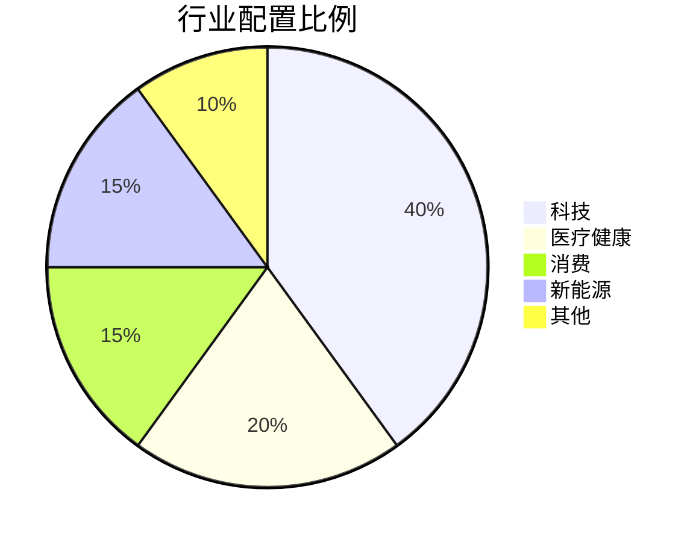

# 整体仓位配置策略

## 🎯 配置原则

> [!success] 核心原则
> - **稳健优先**: 控制风险，确保资金安全
> - **分散投资**: 避免单一股票过重仓位
> - **灵活调整**: 根据市场情况动态调整
> - **纪律执行**: 严格按照策略执行，避免情绪化决策

---

## 📊 基准配置

### 资金分配

| 类别 | 比例 |
|------|------|
| **核心持仓** | 60-70% |
| **成长进攻** | 20-25% |
| **价值修复** | 10-15% |
| **现金储备** | 5-10% |

### 行业配置

| 行业 | 比例 |
|------|------|
| 科技 | 40% |
| 医疗健康 | 20% |
| 消费 | 15% |
| 新能源 | 15% |
| 其他 | 10% |

---

## 🔄 动态调整策略

### 市场环境应对

| 市场环境 | 策略调整 |
|----------|----------|
| **牛市** | 增加成长股比例，降低现金储备 |
| **熊市** | 增加现金储备，降低成长股比例 |
| **震荡市** | 保持均衡配置，关注价值股 |

### 个股调整触发条件

> [!tip] 调整信号
> - **止损**: 单只股票下跌5-7%触发止损
> - **止盈**: 单只股票上涨15-20%考虑部分止盈
> - **基本面恶化**: 及时减仓或清仓
> - **估值过高**: 逐步减仓

---

## 📅 定期再平衡

| 周期 | 任务 |
|------|------|
| **月度** | 检查整体配置比例 |
| **季度** | 进行全面再平衡 |
| **年度** | 重新评估策略有效性 |

---

## ⚠️ 风险控制

> [!danger] 风控红线
> - **单只股票上限**: 不超过总资产的20%
> - **单日最大亏损**: 不超过总资产的2%
> - **单月最大亏损**: 不超过总资产的10%
> - **杠杆使用**: 禁止使用杠杆

---

## 🎯 执行流程

1. **每月初**: 制定本月配置计划
2. **每周日**: 评估当前配置情况
3. **每日收盘**: 检查止损止盈条件
4. **重大事件**: 及时调整配置

---

## 相关笔记

[[电力行业投资策略]] | [[交易策略模板]] | [[2026-03-16交易日志]]
